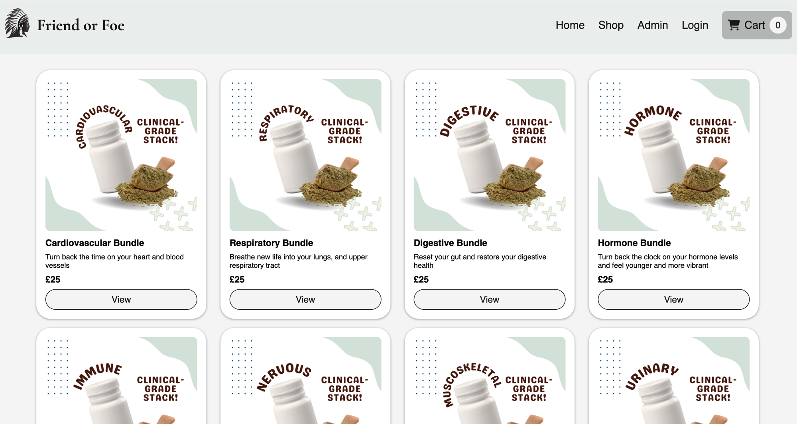
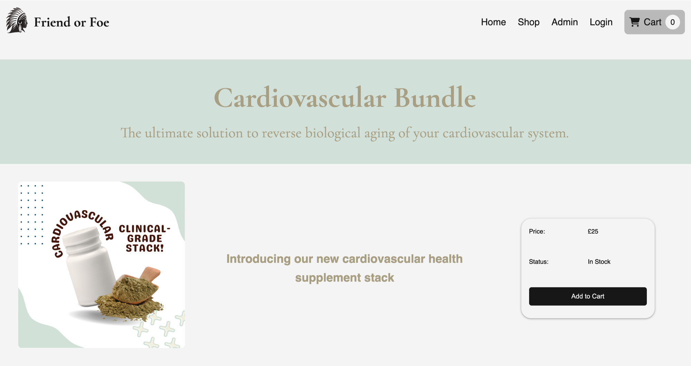
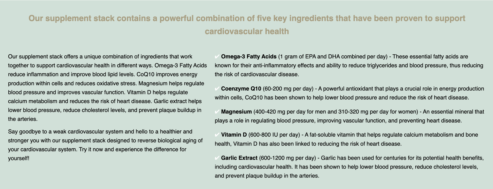
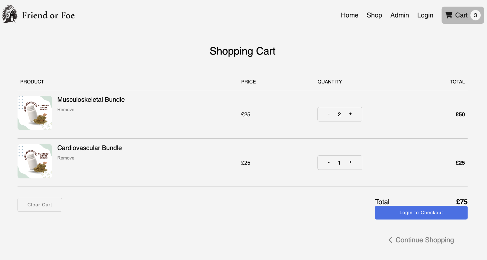
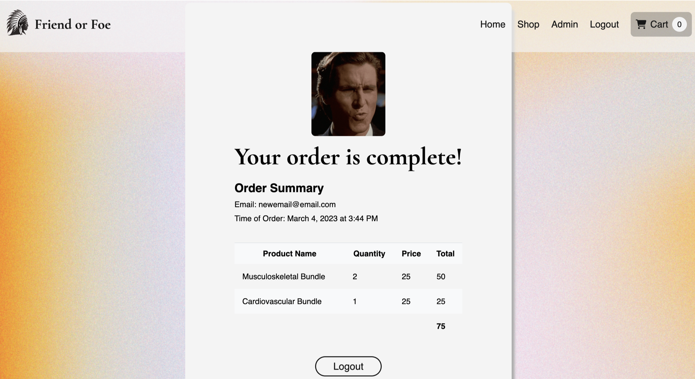

# Full-Stack MERN eCommerce Application

Try it here: https://ecommerce-app-inb9.onrender.com/home 

## Desktop view

This is a simple eCommerce website. The eCommerce flow (as seen here) is part of a conceptual larger digital enterprise that focuses on all-facets of lifespan / healthspan extension. This particular segment focuses on the sale of supplements to support health / wellbeing, from an organ systems perspective (something not currently pursued in the market). Informed by diagnostic tests capturing biomarkers associated with each organ system, the client could then be directed to the appropriate supplement stack as indicated. 

The site was designed as my capstone project on the HyperionDev coding bootcamp. Given the short time constraints imposed on the project, there are numerous improvements that I intend to refactor into the codebase in the near future, including:

* Improved state management (utilising and implementing Redux more consistently)

* Improved error handling (incorporating error handling into the user interface during the registration / log-in flows)

* Product catalogue management (finding alternative ways to store and render product information)
* Stripe API integration to enable payment flows

* General code refactoring for consistency / efficiency

## Quick start

Clone the repo.

~~~
// Install dependencies (in root and client)
npm install

// Run client and server concurrently
npm run dev 
~~~

## Technology

This is a full-stack application, built using:

* React
* Javascript
* JSX
* CSS
* HTML
* MongoDB
* Mongoose
* Node
* Express
* Jsonwebtoken
* Bcrypt
* Redux
